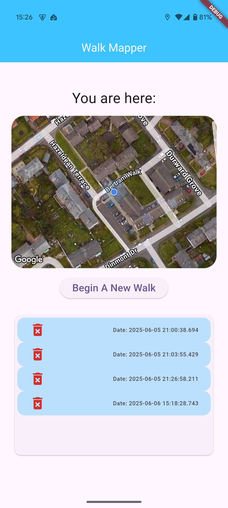
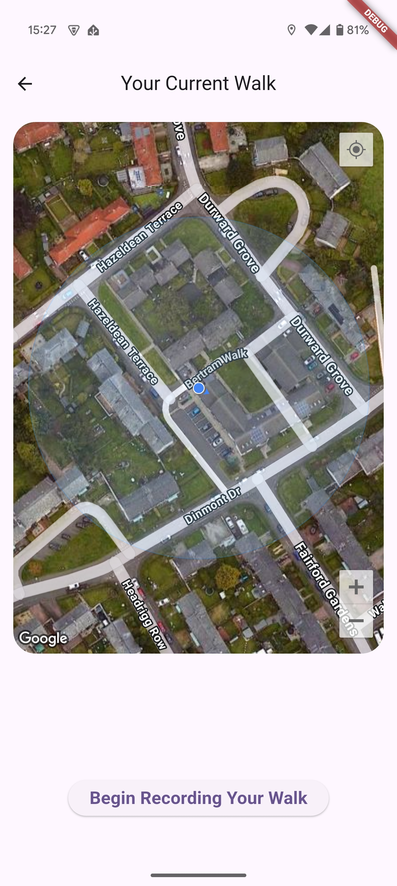
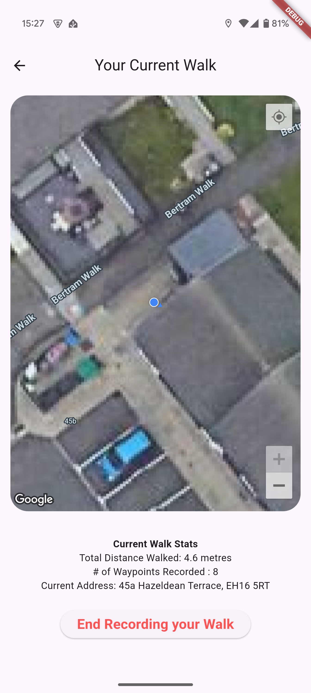

# Walk Mapper

As uni is finished now, I figured I better learn something else.

This project is just a bit of a mess around to learn how the Flutter framework and Dart language behave.

A mobile application for android that allows users to record their walking routes using GPS data overlaid onto Google Maps.

## Basic feature objectives are:

- Have a Homepage that shows the user a preview map with their current location marked, a button to begin a new walk, and a list of previously recorded walks.
- Pressing the "begin a new walk" button takes the user to a lager version of the map and pressing the "begin" button will start recording the user's location and displaying their route on the map.
- During the walk being recorded, some stats will be displayed like the distance travelled, furthest distance recorded on the walk from the start location, nearest street address, number of recorded waypoints, etc.
- Pressing the "end walk" button will stop the walk recording and save it for the user to review later.
- Selecting a previous walk from the Homepage will allow the users to view the route and stats of that walk.

## Bonus features that I'll try if I don't get bored with this:

- During a walk, pressing the "take photo" button will open the device camera and take a photo. 
- Reviewing a walk will show any photos taken during that walk.
- The locations that the photos were taken in will be marked on the map for the user.

Should be a bit of fun.
I only have android devices to test with just now. Might borrow a mac off someone later to try iphone builds.

## Current UI Screenshots

### Homepage

### New Walk Page

### Recording a Walk Interface
 